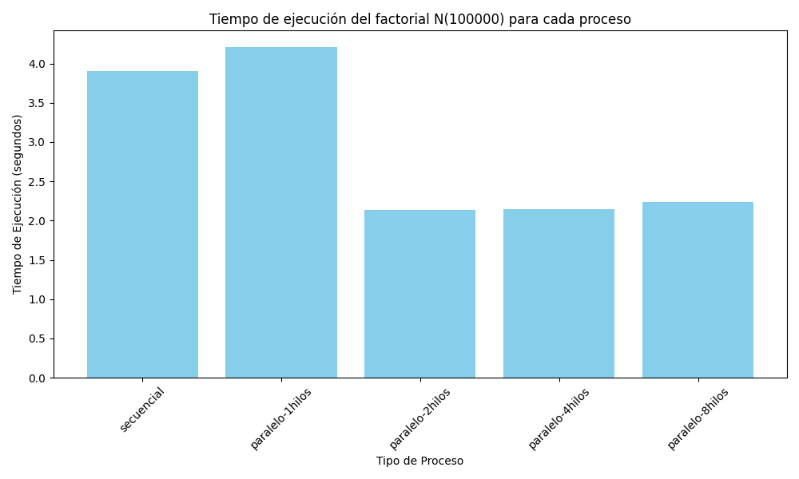

# systems-administration_OpenMP

## Ejercicio 1

Esta sección contiene scripts para evaluar el rendimiento de la ejecución secuencial y paralelizada del cálculo factorial de un número N. Se utilizan programas escritos en C para realizar los cálculos y un script de Python para generar un gráfico que compara los tiempos de ejecución. 

### Contenido

- `factorial_secuencial.c`: Código en C para calcular el factorial de un número N de manera secuencial.

- `factorial_openmp.c`: Código en C para calcular el factorial de un número N de manera paralelizada utilizando OpenMP.

- `generate_execution_graph.py`: Script en Python que ejecuta los programas C, genera un archivo .log con los tiempos de ejecución, y crea un gráfico para visualizar los resultados.

- `requirements.txt`: Lista de dependencias necesarias para ejecutar el script en Python.

### Requisitos

- **Python 3**
- **Entorno virtual de Python** (`venv`)
- **GCC** con soporte para OpenMP
- Paquetes de Python: `matplotlib`, `pandas`
- Para instalar las dependencias de Python, se recomienda utilizar el entorno virtual en conjunto con `requirements.txt`

### Instrucciones de Uso

1. **Actualizar el Sistema**:
   ```bash
   sudo apt update && sudo apt upgrade
   ```

2. **Instalar el Entorno Virtual**:
   ```bash
   sudo apt-get install python3-venv
   ```

3. **Crear un Entorno Virtual**:
   ```bash
   python3 -m venv venv
   source venv/bin/activate
   ```

4. **Instalar Dependencias**:
   ```bash
   pip install -r requirements.txt
   ```

5. **Compilar los Programas en C**:
   Asegúrate de tener `gcc` instalado y compila los programas.

   ```bash
   gcc factorial_secuencial.c -o factorial_secuencial
   gcc factorial_openmp.c -o factorial_openmp -fopenmp
   ```

6. **Ejecutar el Script en Python**:
   Ejecuta el script `generate_execution_graph.py` para calcular los tiempos de ejecución y generar el gráfico comparativo:

   ```bash
   python generate_execution_graph.py
   ```

   El script te pedirá que ingreses el valor de `N` para calcular el factorial, luego ejecutará los programas secuenciales y paralelizados con diferentes números de hilos.

7. **Resultados**:
   - El archivo de log generado se guardará en la carpeta `registro` con un nombre que contiene el valor de `N` y la fecha actual.
   - Se generará un gráfico en formato `.png` que muestra los tiempos de ejecución para cada proceso.

### Estructura del Archivo de Log

El archivo execution_time.log tiene un formato tabular (`tsv`) y contiene la siguiente información:

```markdown
| tipo-proceso     | n-factorial | tiempo-ejecución |
|------------------|-------------|------------------|
| secuencial       | 100000      | 4.016176         |
| paralelo-1hilos  | 100000      | 4.011657         |
| paralelo-2hilos  | 100000      | 2.048726         |
| paralelo-4hilos  | 100000      | 2.039414         |
| paralelo-8hilos  | 100000      | 2.060040         |
```

### Visualización del Gráfico

El gráfico generado se guardará en la carpeta registro con un nombre que contiene el valor de N y la fecha actual.


### Respuesta

El análisis del gráfico muestra que el tiempo de ejecución disminuye cuando se utilizan más de un hilo, pero después de 2 hilos ya no se observa una reducción significativa del tiempo de ejecución. Esto se debe a que el sistema utilizado para la prueba (una máquina virtual Debian) solo tiene 2 núcleos disponibles, lo cual limita la capacidad de aprovechar más hilos.

Sin embargo, se puede observar que el proceso no paralelizado comparado con el que utiliza 2 hilos presenta una reducción en el tiempo de ejecución de aproximadamente la mitad. Esto indica que la paralelización con 2 hilos puede aprovechar mejor los recursos disponibles, distribuyendo el trabajo de forma más eficiente.

Por otro lado, el proceso secuencial (no paralelizado) y el proceso que utiliza 1 hilo tienen un tiempo de ejecución similar, lo cual sugiere que ambos utilizan los recursos del sistema de manera parecida y tienen un costo computacional similar.

Finalmente, se puede hipotetizar que con un mayor número de hilos y suficiente cantidad de núcleos disponibles, el tiempo de cómputo podría reducirse significativamente, mostrando los beneficios de la paralelización a gran escala.

## Ejercicio 2
