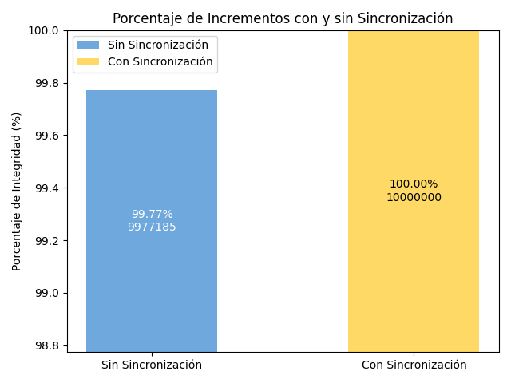
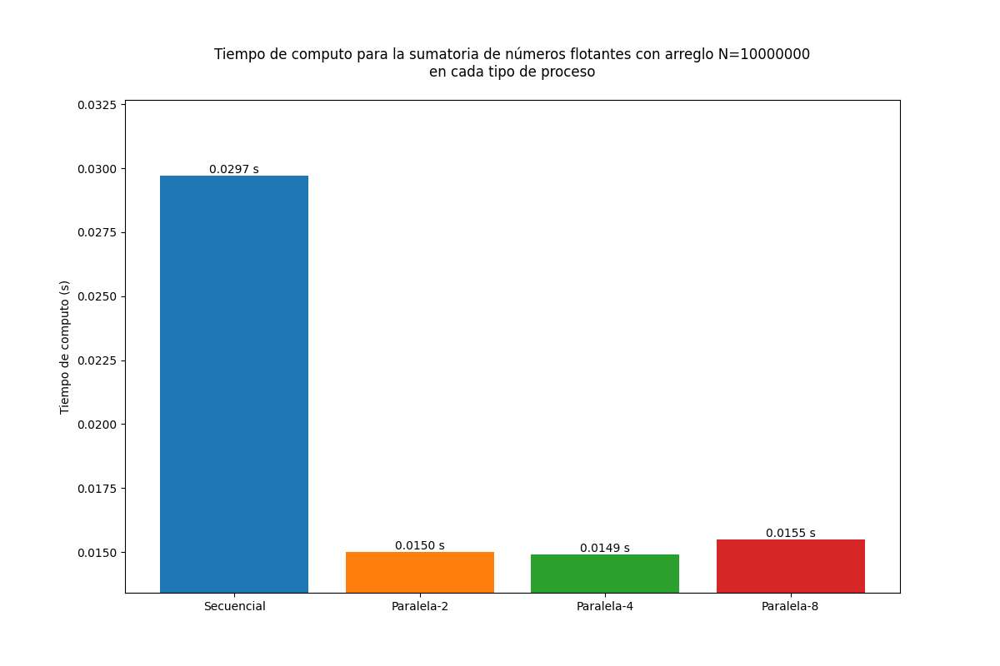
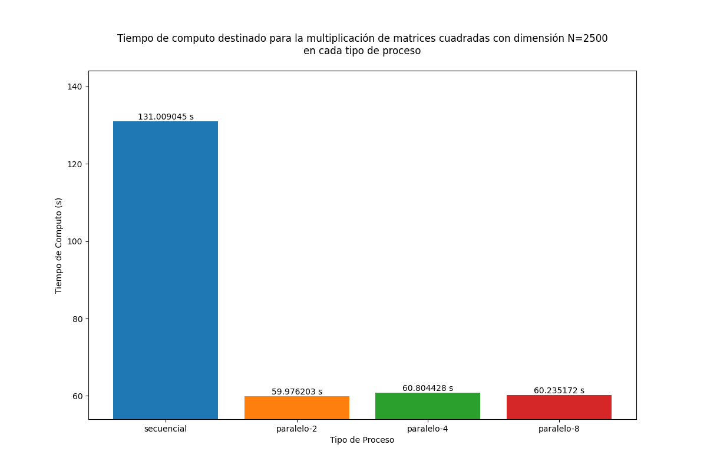

# systems-administration_OpenMP

Este proyecto aborda la paralelización de tareas utilizando OpenMP, explorando su eficiencia para optimizar procesos mediante la asignación de más recursos o hilos. A lo largo de los ejercicios se busca demostrar cómo la paralelización puede mejorar significativamente el rendimiento de cálculos complejos, como la multiplicación de matrices y la realización de incrementos en arreglos. Además, se investigan y evalúan las alternativas para evitar condiciones de carrera, uno de los principales problemas al trabajar con hilos, y se analizan las ventajas y desventajas de la sincronización para garantizar la integridad de los datos. El proyecto proporciona una perspectiva práctica sobre la implementación de técnicas de paralelización y las consideraciones necesarias para maximizar su eficacia.

Para seguir las intrucciones en cada ejercicio se requiere entrar a la carpeta correspondiente (siendo X el número del ejercicio de turno):
```bash
cd ejercicio-X
```

## Ejercicio 1

Esta sección contiene scripts para evaluar el rendimiento de la ejecución secuencial y paralelizada del cálculo factorial de un número N. Se utilizan programas escritos en C para realizar los cálculos y un script de Python para generar un gráfico que compara los tiempos de ejecución. 

### Contenido

- `factorial_secuencial.c`: Código en C para calcular el factorial de un número N de manera secuencial.

- `factorial_openmp.c`: Código en C para calcular el factorial de un número N de manera paralelizada utilizando OpenMP.

- `generate_execution_graph.py`: Script en Python que ejecuta los programas C, genera un archivo .log con los tiempos de ejecución, y crea un gráfico para visualizar los resultados.

- `requirements.txt`: Lista de dependencias necesarias para ejecutar el script en Python.

### Lógica detrás del código

Los programas `factorial_secuencial.c` y `factorial_openmp.c` están escritos en lenguaje C y utilizan librerías estándar del sistema. En ambos archivos, se hace uso de las librerías `<stdio.h>` para las operaciones de entrada y salida, `<stdlib.h>` para la gestión de memoria, y `<time.h>` para medir el tiempo de ejecución. Adicionalmente, `factorial_openmp.c` emplea la librería `<omp.h>`, que es fundamental para habilitar la paralelización utilizando OpenMP.

En `factorial_openmp.c`, la paralelización se logra mediante la directiva `#pragma omp parallel for`, que permite dividir el trabajo de los bucles entre múltiples hilos de ejecución. OpenMP gestiona la creación y sincronización de estos hilos, haciendo posible que diferentes partes del cálculo factorial se realicen de manera simultánea, lo cual reduce significativamente el tiempo de cómputo para ciertos valores de `N`.

El script de Python (`generate_execution_graph.py`) tiene como propósito coordinar la ejecución de los programas C y generar un análisis visual del rendimiento. Para ello, el script utiliza la librería `subprocess` para compilar y ejecutar ambos programas (`factorial_secuencial.c` y `factorial_openmp.c`). Además, usa las librerías `pandas` y `matplotlib` para procesar los datos registrados en el archivo `.log` generado durante las ejecuciones y para crear un gráfico que muestra la comparación de los tiempos de ejecución. Este gráfico permite evaluar el impacto del número de hilos en el rendimiento del cálculo factorial.

### Requisitos

- **Python 3**
- **Entorno virtual de Python** (`venv`)
- **GCC** con soporte para OpenMP
- Paquetes de Python: `matplotlib`, `pandas`
- Para instalar las dependencias de Python, se recomienda utilizar el entorno virtual en conjunto con `requirements.txt`

### Instrucciones de Uso

1. **Actualizar el Sistema**:
   ```bash
   sudo apt update && sudo apt upgrade
   ```

2. **Instalar el Entorno Virtual**:
   ```bash
   sudo apt-get install python3-venv
   ```

3. **Crear un Entorno Virtual**:
   ```bash
   python3 -m venv venv
   source venv/bin/activate
   ```

4. **Instalar Dependencias**:
   ```bash
   pip install -r requirements.txt
   ```

5. **Compilar los Programas en C**:
   Asegúrate de tener `gcc` instalado y compila los programas.

   ```bash
   gcc factorial_secuencial.c -o factorial_secuencial
   gcc factorial_openmp.c -o factorial_openmp -fopenmp
   ```

6. **Ejecutar el Script en Python**:
   Ejecuta el script `generate_execution_graph.py` para calcular los tiempos de ejecución y generar el gráfico comparativo:

   ```bash
   python generate_execution_graph.py
   ```

   El script te pedirá que ingreses el valor de `N` para calcular el factorial, luego ejecutará los programas secuenciales y paralelizados con diferentes números de hilos.

7. **Resultados**:
   - El archivo de log generado se guardará en la carpeta `registro` con un nombre que contiene el valor de `N` y la fecha actual.
   - Se generará un gráfico en formato `.png` que muestra los tiempos de ejecución para cada proceso.

### Estructura del Archivo de Log

El archivo `execution_time-100000N-factorial_15-11-2024.log` tiene un formato tabular (`tsv`) y contiene la siguiente información:

```markdown
| tipo-proceso     | n-factorial | tiempo-ejecución |
|------------------|-------------|------------------|
| secuencial       | 100000      | 4.016176         |
| paralelo-1hilos  | 100000      | 4.011657         |
| paralelo-2hilos  | 100000      | 2.048726         |
| paralelo-4hilos  | 100000      | 2.039414         |
| paralelo-8hilos  | 100000      | 2.060040         |
```

### Visualización del Gráfico

El gráfico generado se guardará en la carpeta registro con un nombre que contiene el valor de N y la fecha actual.


### Respuesta

El análisis del gráfico muestra que el tiempo de ejecución disminuye cuando se utilizan más de un hilo, pero después de 2 hilos ya no se observa una reducción significativa del tiempo de ejecución. Esto se debe a que el sistema utilizado para la prueba (una máquina virtual Debian) solo tiene 2 núcleos disponibles, lo cual limita la capacidad de aprovechar más hilos.

Sin embargo, se puede observar que el proceso no paralelizado comparado con el que utiliza 2 hilos presenta una reducción en el tiempo de ejecución de aproximadamente la mitad. Esto indica que la paralelización con 2 hilos puede aprovechar mejor los recursos disponibles, distribuyendo el trabajo de forma más eficiente.

Por otro lado, el proceso secuencial (no paralelizado) y el proceso que utiliza 1 hilo tienen un tiempo de ejecución similar, lo cual sugiere que ambos utilizan los recursos del sistema de manera parecida y tienen un costo computacional similar.

Finalmente, se puede hipotetizar que con un mayor número de hilos y suficiente cantidad de núcleos disponibles, el tiempo de cómputo podría reducirse significativamente, mostrando los beneficios de la paralelización a gran escala.

## Ejercicio 2

Este ejercicio consiste en una simulación de incrementos en valores aleatorios dentro de un arreglo de N elementos. Se implementa el proceso de incremento de manera paralelizada utilizando OpenMP y se compara el rendimiento y la integridad de los datos con y sin sincronización.

### Contenido

- `incrementos.c`: Código en C que crea un arreglo de N números inicializados en cero. Paraleliza el proceso en el cual cada hilo incrementa un valor aleatorio del arreglo durante M iteraciones. Se implementan versiones con y sin sincronización para observar los efectos de las condiciones de carrera.

- `incrementos_grafica.py`: Script en Python que ejecuta el programa en C, genera un archivo .log con los resultados del proceso de incrementos, y crea un gráfico que compara la integridad del incremento con y sin sincronización.

- `requirements.txt`: Lista de dependencias necesarias para ejecutar el script en Python.

### Lógica detrás del código

El archivo `incrementos.c` utiliza la librería OpenMP para la paralelización del proceso de incrementos. El programa tiene dos versiones del proceso de incremento: una sin sincronización y otra con sincronización. La versión sin sincronización paraleliza los incrementos sin proteger el acceso a los elementos del arreglo, lo cual puede causar problemas de condición de carrera. En la versión con sincronización, se utiliza una sección crítica (`#pragma omp critical`) para asegurar que solo un hilo pueda modificar un elemento del arreglo a la vez, evitando así las condiciones de carrera.

OpenMP se encarga de distribuir las iteraciones entre los diferentes hilos y permite paralelizar el bucle de incrementos mediante la directiva `#pragma omp parallel for`. La sincronización, mediante secciones críticas, es crucial para evitar las condiciones de carrera que ocurren cuando varios hilos intentan acceder y modificar la misma variable simultáneamente.

El script de Python `incrementos_grafica.py` es responsable de ejecutar el programa en C, recopilar los resultados de los incrementos, y generar un gráfico comparativo. Utiliza librerías como `subprocess` para ejecutar el programa en C y `matplotlib` para crear el gráfico a partir del archivo `.log`. Este gráfico muestra la diferencia entre los incrementos con y sin sincronización, permitiendo observar visualmente los efectos de las condiciones de carrera.

Las condiciones de carrera son peligrosas porque afectan la integridad de los datos. Si varios hilos modifican una misma posición del arreglo sin sincronización, algunos incrementos pueden perderse, lo que da como resultado una cantidad incorrecta de incrementos totales. La condición de carrera se comprueba al comparar los incrementos obtenidos con el valor esperado. En el código, se puede observar que, sin sincronización, el número de incrementos suele ser menor al valor esperado, lo cual indica la pérdida de datos debido a la falta de control sobre el acceso concurrente. OpenMP solventa este problema proporcionando mecanismos de sincronización como secciones críticas para asegurar que cada hilo tenga acceso exclusivo a las variables compartidas durante las operaciones de modificación. Sin embargo, el uso de OpenMP para evitar la condición de carrera puede volver más exhaustivo el proceso, lo que significa que el tiempo de cómputo necesario con OpenMP, comparado con la versión secuencial del script, puede ser mayor debido a la sobrecarga introducida por la sincronización (esto se puede observar comprobando los logs generados por el programa).

### Requisitos

- **Python 3**
- **Entorno virtual de Python** (`venv`)
- **GCC** con soporte para OpenMP
- Paquetes de Python: `matplotlib`
- Para instalar las dependencias de Python, se recomienda utilizar el entorno virtual en conjunto con `requirements.txt`

### Instrucciones de Uso

1. **Actualizar el Sistema**:
   ```bash
   sudo apt update && sudo apt upgrade
   ```

2. **Instalar el Entorno Virtual**:
   ```bash
   sudo apt-get install python3-venv
   ```

3. **Crear un Entorno Virtual**:
   ```bash
   python3 -m venv venv
   source venv/bin/activate
   ```

4. **Instalar Dependencias**:
   ```bash
   pip install -r requirements.txt
   ```

5. **Compilar los Programas en C**:
   Asegúrate de tener `gcc` instalado y compila los programas.

   ```bash
   gcc -fopenmp incrementos.c -o incrementos
   ```

6. **Ejecutar el Script en Python**:
   Ejecuta el script `incrementos_grafica.py` para realizar el proceso de incrementos y generar el gráfico comparativo:

   ```bash
   python incrementos_grafica.py
   ```

   El script ejecutará el programa C, generará un archivo `.log` con los resultados y creará un gráfico que compara los incrementos con y sin sincronización.

8. **Resultados**:
   - El archivo de log generado se guardará en la carpeta `registros` con un nombre que contiene los valores de `N`, `M`, el número de hilos y la fecha actual.
   - Se generará un gráfico en formato `.png` que muestra la integridad de los incrementos con y sin sincronización.

### Estructura del Archivo de Log

El archivo `.log` generado contiene la siguiente información:

```markdown
#
tipo-proceso    sin-sincronización
numero-hilos    2
numero-iteraciones    10000000
tiempo-demora    0.418960
total-incrementos    9977185
resultado-incremento    arreglo[0]    14
...
#
tipo-proceso    con-sincronización
numero-hilos    2
numero-iteraciones    10000000
tiempo-demora    0.499188
total-incrementos    10000000
resultado-incremento    arreglo[0]    14
...
#
numero-inconsistencias    22815
```

### Visualización del Gráfico

El gráfico generado se guardará en la carpeta `registros` con un nombre que contiene los valores de `N`, `M`, el número de hilos y la fecha actual.



### Respuesta

El análisis del gráfico muestra que, al no usar sincronización, los incrementos en el arreglo presentan inconsistencias debido a las condiciones de carrera. Esto se traduce en un número de incrementos menor al esperado, ya que diferentes hilos intentan actualizar los mismos elementos del arreglo simultáneamente sin ningún tipo de protección.

Por otro lado, cuando se utiliza sincronización, los incrementos son consistentes y el total de incrementos coincide con el valor esperado. Sin embargo, esto implica un costo de tiempo mayor, ya que la sincronización añade una sobrecarga debido a la necesidad de asegurar el acceso exclusivo a los elementos del arreglo.

Este ejercicio muestra la importancia de la sincronización al paralelizar operaciones que modifican estructuras de datos compartidas, así como el compromiso entre rendimiento y consistencia que se debe tener en cuenta al trabajar con sistemas paralelos.

## Ejercicio 3

Este ejercicio consiste en la sumatoria de valores flotantes dentro de un arreglo de `N` elementos generados aleatoriamente. Se implementa la sumatoria de manera secuencial y paralelizada utilizando OpenMP, y se compara el tiempo de cómputo en ambos casos, probando la versión paralelizada con diferentes números de hilos.

### Contenido

- `sumatoria_flotante.c`: Código en C que genera un arreglo de `N` números flotantes aleatorios entre 0 y 1. Implementa la suma de los elementos del arreglo de forma secuencial y paralelizada con 2, 4 y 8 hilos, utilizando OpenMP.

- `graficar_sumatoria_flotante.py`: Script en Python que compila y ejecuta el programa en C, genera un archivo `.log` con los resultados del proceso de sumatoria, y crea un gráfico que compara el tiempo de cómputo en cada tipo de proceso (secuencial y paralelizado).

- `requirements.txt`: Lista de dependencias necesarias para ejecutar el script en Python.

### Lógica detrás del código

El código en C (`sumatoria_flotante.c`) utiliza, nuevamente, varias librerías estándar de C, como `<stdio.h>` para la entrada y salida, `<stdlib.h>` para la generación de números aleatorios, `<omp.h>` para la paralelización con OpenMP, y `<time.h>` para medir el tiempo de ejecución. Contiene dos funciones principales: sequential_sum para realizar la suma de manera secuencial, y parallel_sum para realizar la suma de manera paralelizada utilizando 2, 4 y 8 hilos. La función parallel_sum utiliza la directiva `#pragma omp parallel for reduction(+:sum)`, la cual permite que cada hilo calcule una parte de la suma y luego todas las sumas parciales se combinen en una sola variable global, evitando condiciones de carrera.

El script en Python (`graficar_sumatoria_flotante.py`) tiene la utilidad de compilar y ejecutar el programa en C y luego analizar los resultados. Utiliza la librería `subprocess` para ejecutar el programa de C desde el script, y las librerías `matplotlib` y `pandas` para generar un gráfico comparativo a partir del archivo `.log` generado por el programa en C. El gráfico muestra claramente las diferencias de tiempo entre el proceso secuencial y los procesos paralelizados.

En este ejercicio, una condición de carrera podría ocurrir si varios hilos intentaran actualizar simultáneamente la misma variable sin ningún tipo de control. Esto afectaría la integridad de los datos, ya que los resultados parciales podrían perderse o sobrescribirse. La reducción en OpenMP funciona creando variables privadas para cada hilo y combinando los resultados al final, evitando así la interferencia entre hilos y garantizando que todas las contribuciones sean contabilizadas de manera correcta. En este caso, a diferencia de la sincronización, el tiempo de cómputo sí se redujo significativamente, ya que la técnica de reducción minimiza la sobrecarga de coordinación entre hilos, justificando la mejora en el rendimiento.

### Requisitos

- **Python 3**
- **Entorno virtual de Python** (`venv`)
- **GCC** con soporte para OpenMP
- Paquetes de Python: `matplotlib`, `pandas`
- Para instalar las dependencias de Python, se recomienda utilizar el entorno virtual en conjunto con `requirements.txt`

### Instrucciones de Uso

1. **Actualizar el Sistema**:
   ```bash
   sudo apt update && sudo apt upgrade
   ```

2. **Instalar el Entorno Virtual**:
   ```bash
   sudo apt-get install python3-venv
   ```

3. **Crear un Entorno Virtual**:
   ```bash
   python3 -m venv venv
   source venv/bin/activate
   ```

4. **Instalar Dependencias**:
   ```bash
   pip install -r requirements.txt
   ```

5. **Compilar los Programas en C**:
   Asegúrate de tener `gcc` instalado y compila los programas.

   ```bash
   gcc -fopenmp sumatoria_flotante.c -o sumatoria_flotante
   ```

6. **Ejecutar el Script en Python**:
   Ejecuta el script `graficar_sumatoria_flotante.py` para realizar la sumatoria y generar el gráfico comparativo:

   ```bash
   python graficar_sumatoria_flotante.py
   ```

   - El script solicitará el valor de `N` y compilará el programa en C, generará un archivo `.log` con los resultados y creará un gráfico que muestra el tiempo de cómputo en cada tipo de proceso.

8. **Resultados**:
   - El archivo de `log` generado se guardará en la carpeta registros con un nombre que contiene el valor de `N` y la fecha actual.

   - Se generará un gráfico en formato `.png` que muestra el tiempo de cómputo para la sumatoria de los valores flotantes en cada tipo de proceso (secuencial y paralelizado con diferentes hilos).

### Estructura del Archivo de Log

El archivo `sumatoria-flotante_n10000000_16-11-2024.log` tiene un formato tabular (`tsv`) y contiene la siguiente información:

```markdown
| Version    | Tiempo |
|------------|--------|
| Secuencial | 0.0297 |
| Paralela-2 | 0.0150 |
| Paralela-4 | 0.0149 |
| Paralela-8 | 0.0155 |
```

### Visualización del Gráfico

El gráfico generado se guardará en la carpeta registros con un nombre que contiene el valor de N y la fecha actual. Muestra el tiempo de cómputo para la sumatoria de los valores flotantes en cada tipo de proceso (secuencial y paralelizado).



### Respuesta

La reducción en OpenMP permite evitar condiciones de carrera al sumar los valores del arreglo, ya que cada hilo tiene su propia variable privada para acumular la suma parcial. Al final del proceso, las sumas parciales se combinan automáticamente en una única variable global, garantizando que no haya conflictos de acceso concurrente entre los hilos. Esto asegura que el resultado final sea correcto y que todos los valores se sumen sin perder ninguna contribución debido a la concurrencia.

En el gráfico generado, se observa que el tiempo de cómputo disminuye al pasar de un proceso secuencial a uno paralelo con 2 hilos. Sin embargo, no hay una variación significativa en el tiempo al aumentar a 4 y 8 hilos. Esto se debe a que la máquina virtual utilizada tiene solo 2 núcleos, lo cual limita la capacidad de paralelización efectiva más allá de los 2 hilos, haciendo que el tiempo de ejecución sea aproximadamente similar en los procesos paralelizados con 2 o más hilos en este caso.

## Ejercicio 4

Este ejercicio consiste en la implementación y análisis del rendimiento de la multiplicación de dos matrices cuadradas de dimensión NxN. Se implementa la multiplicación de matrices de forma secuencial y de forma paralelizada utilizando OpenMP, y se comparan los tiempos de ejecución para cada método.

### Contenido

- `multi-matrices.c`: Código en C que realiza la multiplicación de dos matrices cuadradas de dimensión NxN. Primero se implementa de forma secuencial y luego se paraleliza dividiendo el trabajo por filas entre los hilos utilizando OpenMP. Se registran los tiempos de ejecución tanto para el cálculo secuencial como para el paralelo con 2, 4 y 8 hilos.

- `graficar_multi-matrices.py`: Script en Python que compila y ejecuta el programa en C, genera un archivo .log con los resultados de la multiplicación de matrices, y crea un gráfico que compara los tiempos de ejecución para los distintos tipos de proceso (secuencial y paralelo).

- `requirements.txt`: Lista de dependencias necesarias para ejecutar el script en Python.

### Lógica detrás del código

El código `multi-matrices.c` utiliza, otra vez, las clásicas librerías `stdio.h` para la entrada y salida de datos, `stdlib.h` para la gestión de memoria dinámica, `omp.h` para la paralelización mediante OpenMP, y `time.h` para medir los tiempos de ejecución. La lógica del programa se divide en dos funciones principales: `calcular_secuencial`, que realiza la multiplicación de matrices de forma secuencial, y `calcular_paralelo` que paraleliza el cálculo de forma dinámica utilizando `schedule(dynamic)` para mejorar el balance de carga entre los diversos hilos. La paralelización se lleva a cabo mediante la directiva `#pragma omp parallel for`, que permite dividir el cálculo entre los hilos, haciendo uso eficiente de los recursos del sistema.

El script `graficar_multi-matrices.py` en Python tiene la utilidad de automatizar la compilación y ejecución del código en C, además de generar un archivo `.log` con los resultados y visualizar estos mediante un gráfico. Utiliza librerías como `subprocess` para ejecutar comandos del sistema y `matplotlib` para crear el gráfico. El script primero ejecuta el programa en C, que genera un archivo `.log` en la carpeta registros. Este archivo contiene información sobre los tiempos de ejecución para cada tipo de proceso (secuencial y paralelo con 2, 4, y 8 hilos). Luego, el script lee este archivo y crea un gráfico que muestra una comparación visual de los tiempos de ejecución.

La generación de los archivos .log sigue un formato TSV (valores separados por tabulaciones) e incluye los siguientes campos: tipo-proceso (secuencial o paralelo con diferentes números de hilos), dimension-matrices (valor de N), y tiempo (tiempo de ejecución en segundos).

El tamaño de la matriz (N) y el número de hilos afectan significativamente el tiempo de ejecución. A medida que N aumenta, la cantidad de operaciones necesarias para multiplicar las matrices también aumenta exponencialmente, lo que incrementa el tiempo de cómputo. La paralelización permite reducir este tiempo al dividir el trabajo entre varios hilos, aprovechando los recursos de procesamiento disponibles. Sin embargo, la ventaja de paralelizar depende de la relación entre el tamaño del problema y el número de hilos. Para tamaños pequeños de matrices, la sobrecarga de crear y coordinar los hilos puede superar las ganancias, mientras que para tamaños grandes, la paralelización permite un rendimiento significativamente mejor. Esto demuestra la importancia de paralelizar procesos para reducir tiempos de ejecución en problemas computacionalmente intensivos, especialmente cuando se dispone de múltiples núcleos de procesamiento.

### Requisitos

- **Python 3**
- **Entorno virtual de Python** (`venv`)
- **GCC** con soporte para OpenMP
- Paquetes de Python: `matplotlib`
- Para instalar las dependencias de Python, se recomienda utilizar el entorno virtual en conjunto con `requirements.txt`

### Instrucciones de Uso

1. **Actualizar el Sistema**:
   ```bash
   sudo apt update && sudo apt upgrade
   ```

2. **Instalar el Entorno Virtual**:
   ```bash
   sudo apt-get install python3-venv
   ```

3. **Crear un Entorno Virtual**:
   ```bash
   python3 -m venv venv
   source venv/bin/activate
   ```

4. **Instalar Dependencias**:
   ```bash
   pip install -r requirements.txt
   ```

5. **Compilar los Programas en C**:
   Asegúrate de tener `gcc` instalado y compila los programas.

   ```bash
   gcc -fopenmp multi-matrices.c -o multi_matrices
   ```

6. **Ejecutar el Script en Python**:
   Ejecuta el script `graficar_multi-matrices.py` para realizar la multiplicación de matrices y generar el gráfico comparativo:

   ```bash
   python graficar_multi-matrices.py
   ```

   - El script ejecutará el programa en C, generará un archivo .log con los resultados y creará un gráfico que compara los tiempos de ejecución secuencial y paralelo.

8. **Resultados**:
   - El archivo de log generado se guardará en la carpeta registros con un nombre que contiene la dimensión de la matriz y la fecha actual.

   - Se generará un gráfico en formato .png que muestra el tiempo de ejecución para cada tipo de proceso.

### Estructura del Archivo de Log

El archivo .log generado contiene la siguiente información en formato TSV:

```markdown
| tipo-proceso  | dimension-matriz  | tiempo      |
|---------------|-------------------|-------------|
| secuencial    | 2500              | 131.009045  |
| paralelo-2    | 2500              | 59.976203   |
| paralelo-4    | 2500              | 60.804428   |
| paralelo-8    | 2500              | 60.235172   |
```

### Visualización del Gráfico

El gráfico generado se guardará en la carpeta registros con un nombre que contiene la dimensión de la matriz y la fecha actual.



### Respuesta

El análisis del gráfico muestra que, a medida que aumenta el tamaño de la matriz (N), el tiempo de ejecución también aumenta debido a la mayor cantidad de operaciones necesarias. La paralelización permite reducir el tiempo de ejecución dividiendo el trabajo entre varios hilos. Sin embargo, el rendimiento mejora hasta cierto punto, ya que el costo de coordinación entre hilos y la sobrecarga de creación de hilos pueden limitar los beneficios. Además, para tamaños pequeños de matrices, la sobrecarga de paralelización puede superar las ganancias, mientras que para tamaños más grandes, la paralelización muestra mejoras significativas en el rendimiento.

## Errores encontrados en el desarrollo

Durante el desarrollo de los ejercicios se identificaron diversos errores que requirieron soluciones específicas para continuar con el trabajo. A continuación, se describen algunos de los errores encontrados y cómo fueron solucionados:

1. Error de Segmentación: Se encontró un error de segmento debido a la asignación limitada de recursos. Esto ocurrió en la máquina virtual Debian y se solucionó con el siguiente comando:
   ```bash
   ulimit -s unlimited
   ```
   - Este comando permite aumentar el tamaño máximo de la pila, evitando así el error de segmentación cuando se realizan asignaciones de memoria grandes.

2. Limitación de Recursos en Máquina Virtual: Al desarrollar los ejercicios en una máquina virtual con recursos limitados (2 núcleos), se observó que la asignación de múltiples hilos en el código no generaba una mejora significativa en el tiempo de ejecución. Esto se debe a que el número de núcleos disponibles era insuficiente para aprovechar la paralelización con más de 2 hilos.

3. Falta de `schedule(dynamic)`: En una primera instancia, el código paralelo no utilizaba la cláusula schedule(dynamic) para repartir el trabajo entre los recursos. Como resultado, el comportamiento del programa era similar al de un cálculo secuencial debido a la distribución ineficiente del trabajo. La solución fue añadir schedule(dynamic) para mejorar el balance de carga entre los hilos.

4. Valores Extremos de N (y M, según sea el caso): Se identificaron problemas al evaluar valores extremos de N. Para valores bajos de N, los procesos secuenciales y paralelos no mostraban diferencias notorias en el tiempo de ejecución, debido al costo bajo de la operación. Para valores muy grandes de N, el proceso podía morir prematuramente o quedar bloqueado, consumiendo recursos sin finalizar. La solución fue limitar los valores de N a un rango que permita una evaluación adecuada sin sobrecargar los recursos del sistema.

Estos errores ilustran algunos de los desafíos comunes en el desarrollo de aplicaciones paralelas y la necesidad de ajustar tanto los parámetros del sistema como el código para optimizar el rendimiento y evitar fallos durante la ejecución.


